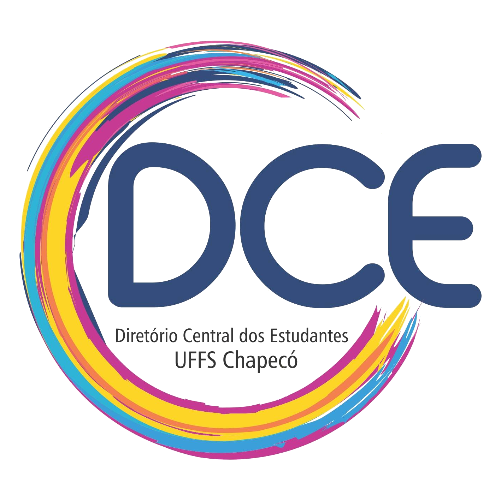

# Painel administrativo em php, usando métodos MVC.

     
    
    

This panel project is being done in pure php. For a future creation of a website for news posts, groups and for the dissemination of events at the Federal University of Fronteira Sul - Campus Chapéco.
